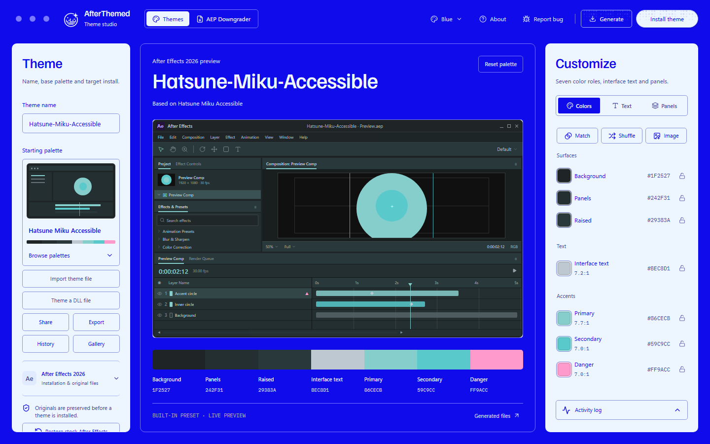
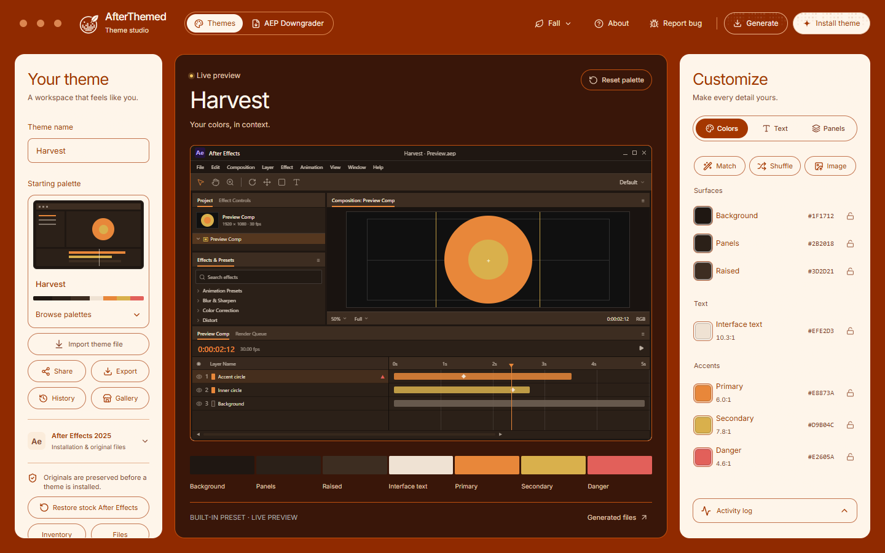
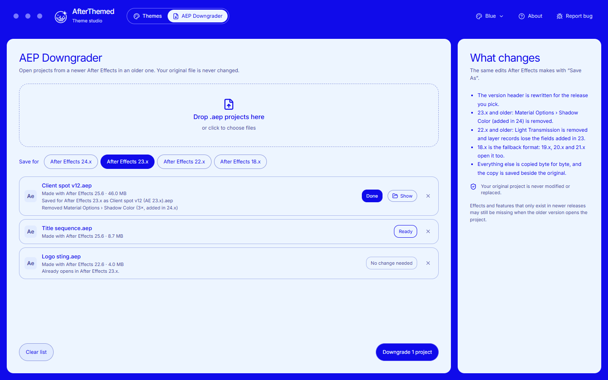
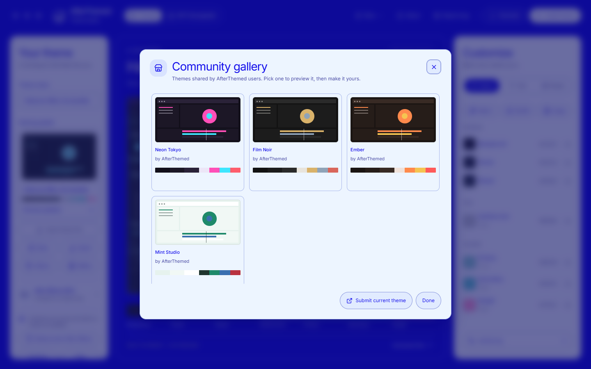
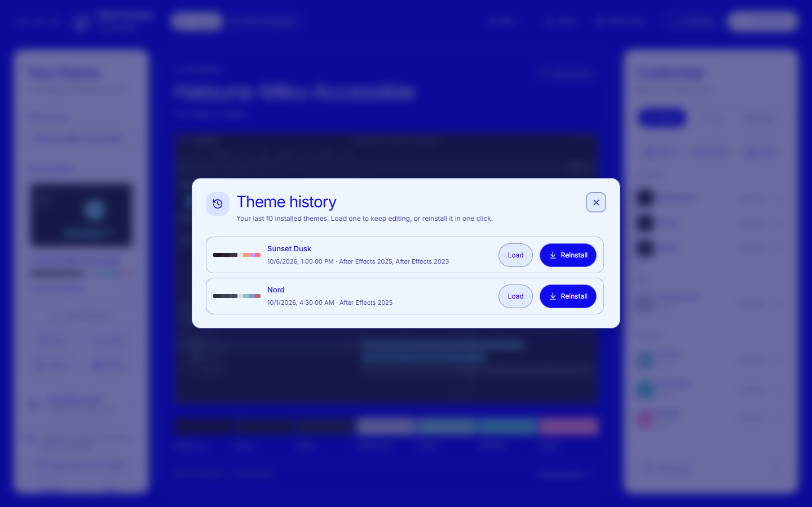

<p align="center">
  
</p>

<h1 align="center">AfterThemed</h1>

<p align="center"><strong>A controlled way to rebuild the After Effects interface around your own palette.</strong></p>

<p align="center">
  AfterThemed brings native colors, interface typography, and CEP panel styling into one Windows workspace—with a preview before the first file is touched and a verified path back to the original.
</p>

<p align="center">
  <a href="https://github.com/sorflow/afterthemed/actions/workflows/build.yml"></a>
  <a href="https://github.com/sorflow/afterthemed/releases/latest"></a>
  <a href="LICENSE.txt"></a>
  
</p>

<p align="center">
  <a href="https://github.com/sorflow/afterthemed/releases/latest"><strong>Download the latest release</strong></a>
  ·
  <a href="CHANGELOG.md">Changelog</a>
  ·
  <a href="CONTRIBUTING.md">Contributing</a>
  ·
  <a href="SECURITY.md">Security</a>
</p>

<p align="center">
  
</p>

## New in 2.0

- **A new look.** The editor keeps its blue and ice colors with its own typography: Familjen Grotesk headings, native Windows text for controls, and IBM Plex Mono for hex codes, contrast ratios, and paths. Only **Install theme** is a pill, and the seven color roles read as one specimen bar with their hex codes.
- **Theme a DLL file.** Theme a `dvaui.dll` (and `AfterFXLib.dll`) copied from another PC. The themed copies go in a new folder with install instructions, and the files you pick are never changed.
- **One prompt for every version.** Installing to every detected After Effects version themes each from its own preserved original and installs them together with a single Windows permission prompt. Anything that fails is rolled back.

## New in 1.3.13

| Themes | AEP Downgrader |
| --- | --- |
|  |  |

- **AEP Downgrader.** A second tab converts projects from newer After Effects releases so older ones can open them: 24.x, 23.x, 22.x, and 18.x, the fallback format that 19.x, 20.x, and 21.x also open. Drop `.aep` files in or right-click a project in Explorer. The original is never modified; the copy is saved beside it as `name (AE 23.x).aep`.
- **Palette tools.** Contrast scores on every text and accent color with one-click fixes, **Match** (build surfaces from your primary color), **Shuffle** with per-color locks, and **Image**, which extracts a palette from a poster or still. Hover a color to see every place it appears in the preview.
- **Share, export, history, gallery.** Share a theme as a short `AT1-…` code, export and import `.afterthemed` files with a thumbnail, reinstall any of your last ten themes, and browse community themes.
- **Safer installs.** A prominent **Restore stock After Effects** action, optional install to every detected version at once, and a notice with **Re-apply** when an After Effects update replaces your theme. Your work-in-progress theme is restored when you reopen the app.
- **Appearances.** Blue, Ice, Midnight, and the new **Fall**: ember and cream, a cocoa preview, a leaf in the logo, and suggested autumn palettes. 50 built-in palettes in total.
- **New identity and installer.** A new logo and app icon, a reworked update prompt, and a branded installer with install-for-me or all-users, folder and Start menu choices, optional sign-in launch, `.afterthemed` file association, and a **Downgrade with AfterThemed** Explorer command for `.aep` files.

<p align="center">
  
  
</p>

## One editor, three surfaces

| Native interface | Extension panels | Typography |
| --- | --- | --- |
| Map validated DVAUI color roles to a custom palette without changing the DLL's size or architecture. | Discover CEP panels, rewrite supported HTML and CSS colors, and maintain a persistent host-theme override. | Choose from installed Windows font families that fit the fixed-width DVAUI font slots safely. |

ScriptUI panels are inventoried separately. AfterThemed does not pretend compiled JSX or JSXBIN code is CSS.

## The workflow

**Import Theme** also accepts DVAUI `.dll` files, including renamed and already-themed copies. It reads supported color tables and Spectrum JSON resources without executing or changing the donor. Recognized built-in themes retain their roles; unknown themes get inferred, editable color roles. Review the preview, then use Generate or Install for the selected target installation. The target keeps its own binary layout, allowing palette transfers across supported AE builds. This transfers the editor's palette roles, not every resource, font, or version-specific UI detail; unsupported DLL layouts are rejected.

```text
Choose installation
        ↓
Preserve the signed original
        ↓
Build or import a palette
        ↓
Preview native UI and panel roles
        ↓
Generate, install, restart After Effects
        ↓
Restore from verified backups whenever needed
```

Every native edit begins from an immutable Adobe-signed original captured on the user's machine. Generated variants are checked before installation, the current target is backed up before replacement, and restore output is verified by hash.

## What it handles

- Structurally validated Windows x64 DVAUI releases in the CC 2018–2026 range, including the 14.6 `DROVER-VARS` and 26.3 `DROVER-DNA-VARS` layouts.
- Native DVAUI background, panel, raised-surface, text, primary, secondary, and danger roles, including the companion native color resources used by After Effects 2020.
- Built-in palettes plus imports from `.theme`, `.css`, `.json`, and `.xml` files.
- CSS hexadecimal, RGB, HSL, ARGB, and gradient color discovery.
- Fixed-length UI text replacement with explicit size checks.
- Installed-font discovery filtered for DVAUI-compatible family names.
- CEP discovery across the selected After Effects installation and standard user and system locations.
- Runtime CSS variables for panels that rebuild their interface after launch.
- Inline SVG, CSS-in-JS, ordinary canvas-stroke, and host-theme color adaptation.
- Per-file panel backups, operation reports, and byte-exact restoration.

## Safety model

AfterThemed works on files that can stop After Effects from launching when handled carelessly. The application keeps the risky parts narrow and visible:

1. The selected original must pass structure and Adobe-signature checks.
2. Original snapshots are stored outside the application installation directory.
3. A generated DLL must keep the original architecture, length, and expected structure.
4. For After Effects 2020, the validated DVAUI and companion native color file are installed or restored as one rollback-safe set.
5. A newer setup removes the registered older app version before installing and leaves snapshots, backups, and settings in the separate user-data directory.
6. Installation is blocked while After Effects is running.
7. Existing targets and every panel file are backed up before replacement.
8. Restore operations verify the recovered bytes instead of assuming the copy succeeded.

Keep an external backup of important installations. Product updates, security software, permissions, disk failures, and third-party extension behavior remain outside AfterThemed's control.

### Protected originals

If generation or installation cannot preserve an original, the recovery dialog searches AfterThemed's originals and backup folders, including the older portable editor's Downloads folder. You can also choose another backup folder or DLL. Only Adobe-verified copies matching the selected DLL's exact build are offered. Import rechecks the copied bytes, protects the recovered original, and continues the requested operation. It does not replace the installed DLL until you run Install or Restore. This can avoid an Adobe reinstall when a clean backup still exists; if no matching original survives, a fresh Adobe installation is still required.

Originals are grouped into readable AE release folders, for example:

```text
Originals/
  After Effects 2020/
    dvaui.dll - 14.2.0.44 [capture ID]/
    AfterFXLib.dll - 17.1.0.72 [capture ID]/
  After Effects 2025/
  README.txt
  _active/
```

The installation name determines the release label; DVA's internal version is not treated as the AE year. DLL role, exact file build, and capture identity keep companions, hotfixes, and separate installations from being merged. Unidentified installation names use an explicit unidentified-release group.

On startup, with other AfterThemed windows closed, 1.3.13 organizes legacy hash-named folders without changing the captured files or verification records. Active restore references are updated atomically and remain recoverable if migration is interrupted. Conflicts and unreadable records are retained and logged, not overwritten. Both layouts remain readable by the new engine. **Use 1.3.13 or later after organization; older apps do not understand the grouped layout.** Folder labels are navigation aids, not proof that an older backup is trusted. Use the preserved-original folder button to open the library and RESTORE to recover files safely.

The originals store lives in `%LOCALAPPDATA%\AfterThemed\Originals`, outside the app's installation directory. Each new capture has a primary DLL, a second recovery copy, its SHA-256 and installation identity, and a Windows DPAPI record authenticating the metadata. Files are read-only to prevent accidental edits. A snapshot becomes selectable only after all capture files are complete.

Restore checks the protected record and recovered bytes before installing them. It can use the recovery copy when the primary is damaged or missing and can recreate missing native DLLs. New captures also record the adjacent `AfterFX.exe` hash; an Adobe update requires a new matching capture. Legacy snapshots are upgraded only after full Authenticode verification; modified or unverifiable legacy backups remain on disk but are not offered as clean originals.

Protection is tied to the Windows user profile. It does not protect against an administrator, malicious software running as that user, loss of the disk, or loss of the profile. The companion's existing validation policy checks its Adobe signer and recognized theming markers; this is weaker than the full Authenticode policy used for a fresh `dvaui.dll`. A captured companion baseline is not independent proof of factory-original Adobe bytes. No DLLs are downloaded from third-party sites.

If no verifiable original survives, repair that exact After Effects version through Creative Cloud and select it again. AfterThemed cannot reconstruct unknown original bytes from a modified DLL. Failure details are saved locally under `%LOCALAPPDATA%\AfterThemed\Logs`; nothing is uploaded automatically.

## Install

1. Download `AfterThemed-Setup-2.0.0.exe` from the [latest release](https://github.com/sorflow/afterthemed/releases/latest).
2. Review and accept the proprietary EULA in Setup. Choose **Install for me only** (no administrator rights) or **Install for all users**, and pick the shortcuts and file associations you want.
3. Launch AfterThemed and confirm the detected After Effects installation.
4. Build a palette or import an existing theme.
5. Close After Effects, generate the variant, and install it.
6. Restart After Effects after applying native or panel changes.

The installer and every other compiled binary live in [GitHub Releases](https://github.com/sorflow/afterthemed/releases), not in repository history. Installers are not code-signed yet, so Windows SmartScreen or antivirus software may ask for confirmation; compare the download with `SHA256SUMS.txt` from the same release.

### Downgrading projects

Open the **AEP Downgrader** tab, add projects, choose a target, and select **Downgrade**. Each conversion applies the same changes After Effects makes with *Save As*: the version header is rewritten, properties the older release does not have are removed (Shadow Color for 23.x and older; Light Transmission and the newer layer fields for 22.x and older), and everything else is copied byte for byte. The rules were derived from After Effects 25.6 and 23.6 saves and checked by opening the results in After Effects 23.6 and 18.4. Features that exist only in newer releases may still be missing in the older version. The same conversion is available from the command line:

```powershell
AfterThemed.exe --downgrade-aep "project.aep" "project (AE 23.x).aep" 23
```

## Compatibility

| Requirement | Current support |
| --- | --- |
| Operating system | Windows 10 or later, x64 |
| Runtime | Self-contained .NET 9 desktop build |
| Host application | Adobe After Effects installations that pass AfterThemed's structural validation |
| Native target | x64 `dvaui.dll` selected from a licensed local installation; After Effects 2020 also uses its validated companion `AfterFXLib.dll` color resources |
| Web panels | CEP extensions with writable HTML, CSS, SVG, or supported runtime styles |
| ScriptUI | Discovery and inventory; native ScriptUI execution remains owned by the panel author |

Compatibility is validated against the selected file rather than inferred from a folder name or marketing version.

## Build from source

The repository is source-available under proprietary terms. Building requires Windows, the .NET 9 SDK, Node.js 22 with npm, and optionally Inno Setup 6. The main editor is a bundled React/TypeScript interface hosted by WebView2; the existing C# code still performs theme generation, installation, backup, and restore. The app falls back to its native editor if WebView2 is unavailable.

```powershell
dotnet restore .\src\AfterThemed\DvauiThemeEditor.csproj
dotnet build .\src\AfterThemed\DvauiThemeEditor.csproj --configuration Release
```

The .NET build installs the locked web dependencies on first use and builds the local UI into `WebUi` beside the executable. To iterate on the interface in a browser, run `npm run dev` from `src/AfterThemed/web`; browser mode uses sample data. Native actions work only in the WebView2-hosted app.

Build the self-contained installer:

```powershell
.\src\AfterThemed\Installer\Build-Installer.ps1
```

GitHub Actions runs the Windows build, regression suite, CEP smoke test, and installer upgrade test for pushes and pull requests to `main`. Workflow artifacts are unsigned development builds; public downloads should come from Releases.

## Releases and update prompts

The **Build and release** workflow publishes stable releases when a matching `vX.Y.Z` tag is pushed. The `<Version>` in `src/AfterThemed/DvauiThemeEditor.csproj` is the source of truth for the app and installer. A mismatched tag fails before building. Normal branch builds and manual runs on a branch never publish a release.

To ship a release:

1. Update the project's `<Version>` and `CHANGELOG.md`, commit the release changes, and merge them to `main`.
2. From that commit, create and push a matching tag (for example, `git tag v2.0.0` followed by `git push origin v2.0.0`). Use a new version for every release.
3. The workflow builds and tests the Windows x64 installer, generates `SHA256SUMS.txt`, and uploads the installer, checksum, EULA, and license to a draft GitHub Release. It publishes only after all assets are uploaded. GitHub generates the release notes from repository changes.

The publishing job uses the built-in `GITHUB_TOKEN` with `contents: write`; no personal access token is needed. Repository or organization policies must permit that permission. A failed draft upload can be retried by rerunning the workflow. Already-published releases are protected from replacement; publish a new version instead. The release job can also be rerun through a manual workflow dispatch targeting a matching tag. Installers remain unsigned unless code signing is added separately.

AfterThemed checks for a newer stable GitHub Release once each time it opens. The popup offers **Download update** (opens the installer download), **View release**, and **Skip this version**. After downloading, close AfterThemed and run the installer. Skip this version persists the skipped version in `%LOCALAPPDATA%\AfterThemed\ignored-update.txt` and allows a later, newer version to prompt again. Escape or the close button dismisses the popup for the current session only. Delete that preference file to be prompted for an ignored version again. Offline or failed checks do not interrupt startup; drafts, prereleases, and versions no newer than the installed version are not offered.

Run the release-script checks locally with `./tests/ReleasePipeline.Tests.ps1`. These use a mocked GitHub CLI and never publish a release. The [GitHub CLI release documentation](https://cli.github.com/manual/gh_release_create) describes the draft, asset, and tag-verification behavior used by the pipeline.

## Repository guide

| Path | Contents |
| --- | --- |
| `src/AfterThemed` | WinForms host, theming engine, AEP downgrader, backup logic, and installer scripts |
| `src/AfterThemed/web` | React/TypeScript editor hosted in WebView2 |
| `brand` | Logo source artwork |
| `gallery` | Community gallery index read by the app |
| `docs/screenshots` | README screenshots |
| `.github/workflows` | Reproducible Windows x64 build |
| `.github/ISSUE_TEMPLATE` | Structured bug and feature reports |
| `CHANGELOG.md` | Release history |
| `SECURITY.md` | Private vulnerability reporting policy |
| `EULA.txt` | End-user agreement shown by Setup |
| `LICENSE.txt` | Proprietary repository notice |

## Contributing

Start with [CONTRIBUTING.md](CONTRIBUTING.md). Do not submit Adobe binaries, modified DLLs, fonts, paid extensions, private paths, or generated installers. Security reports belong in the [private advisory form](https://github.com/sorflow/afterthemed/security/advisories/new).

## Legal

AfterThemed is independent software created by Drerachi. It is not affiliated with, sponsored by, authorized by, certified by, or endorsed by Adobe Inc.

Adobe, Adobe After Effects, and Creative Cloud are trademarks or registered trademarks of Adobe Inc. This repository contains no Adobe software and grants no rights in Adobe products, `dvaui.dll`, fonts, product icons, or third-party extensions. Users are responsible for determining whether their intended modifications are permitted by the terms and laws that apply to them.

Use and redistribution of AfterThemed are governed by [EULA.txt](EULA.txt) and [LICENSE.txt](LICENSE.txt).
